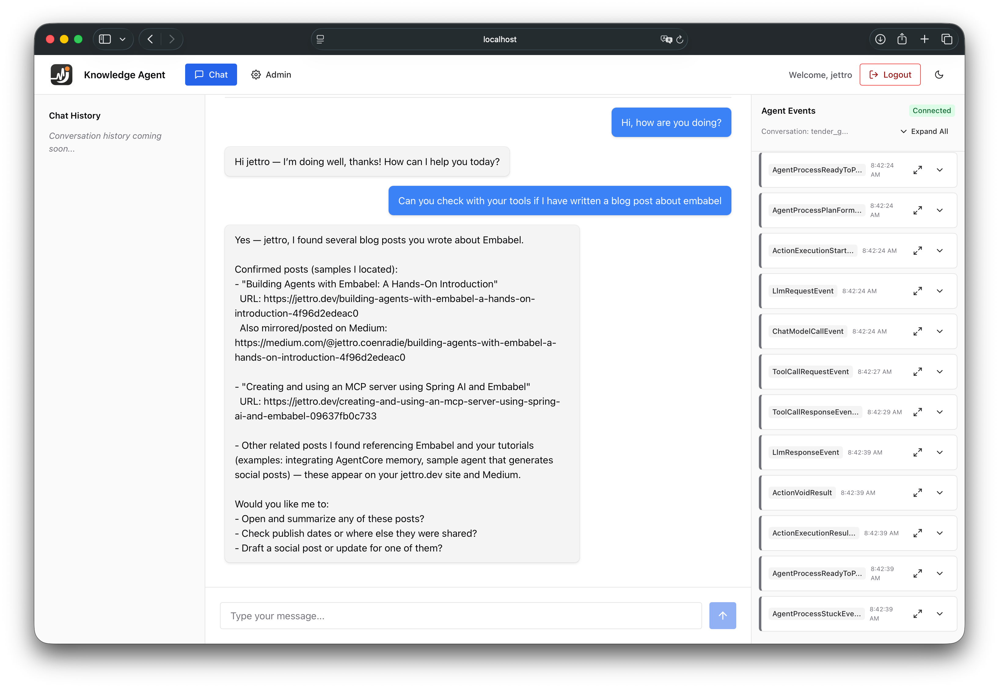
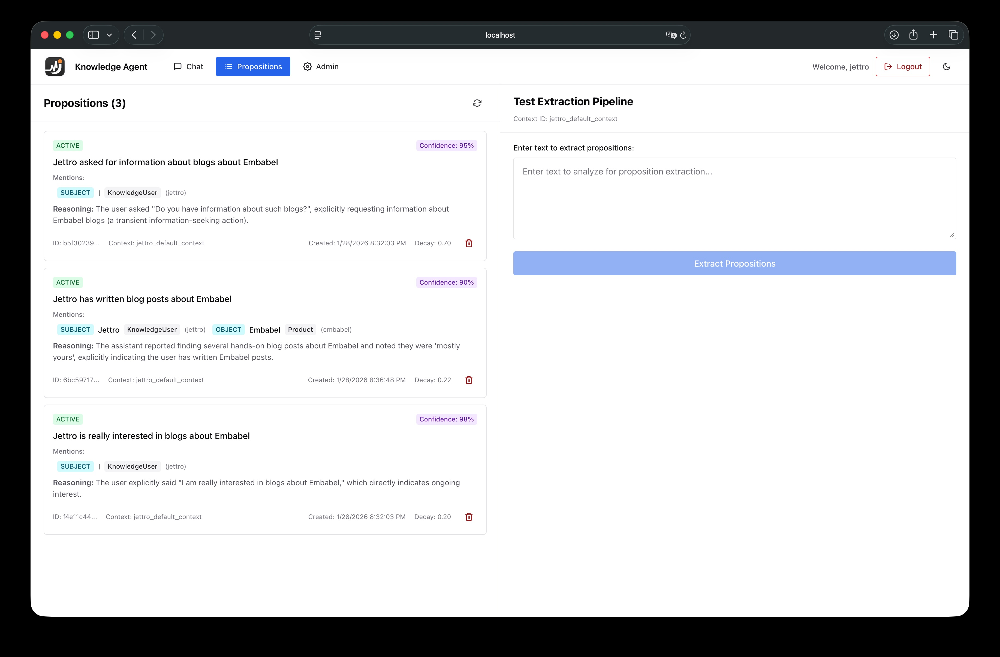

# Knowledge Agent

A full-stack RAG (Retrieval-Augmented Generation) application built with **Embabel** that enables intelligent conversations over your documents. Ask questions about your content, and get accurate, context-aware answers powered by AI and semantic search.

## 🎯 What is this?

Knowledge Agent is a demonstration project showcasing how to build production-ready AI agents using the [Embabel](https://embabel.com) framework on the JVM. It combines:

- **Intelligent document understanding** - Ingest markdown files, PDFs, and other documents
- **Semantic search** - Find relevant information using vector embeddings and Apache Lucene
- **Conversational AI** - Chat naturally with your documents using OpenAI's GPT models
- **Full-stack experience** - Modern React frontend with Chakra UI and robust Java backend
- **Spring Security** - Built-in authentication for secure access

This project serves as both a working application and a reference implementation for building your own AI-powered knowledge bases.


*The chat interface in action - asking questions about Embabel blog posts with real-time agent event monitoring*


*DICE at work - extracting and managing knowledge propositions with entity mentions, reasoning, and confidence scores*

## ✨ Features

- **📚 Document Ingestion**: Automatically process and index documents from the `data/` directory using Apache Tika
- **🔍 Semantic Search**: Leverage Lucene-based vector search to find contextually relevant information
- **💬 Conversational Interface**: Intuitive chat UI with real-time streaming responses
- **🧠 Proposition Memory**: Extract and manage structured knowledge propositions from conversations with DICE (Dynamic Insight Capture Engine)
- **🔐 Authentication**: Spring Security integration with user-aware responses
- **🎨 Modern UI**: React + TypeScript + Vite with Chakra UI components
- **🏗️ Production-Ready**: Spring Boot backend optimized for reliability and performance

## 🏗️ Architecture

```
knowledge-agent/
├── agent/                  # Spring Boot backend application
│   ├── src/main/java/
│   │   └── dev/jettro/knowledge/
│   │       ├── chat/       # Chat actions and SSE streaming
│   │       ├── ingest/     # Document ingestion endpoints
│   │       └── security/   # Authentication configuration
│   └── pom.xml
├── frontend/               # React + Vite frontend
│   ├── src/
│   │   ├── components/     # React components (chat, auth, UI)
│   │   ├── hooks/          # Custom React hooks
│   │   ├── context/        # React context providers
│   │   └── api.ts          # Backend API client
│   └── package.json
├── data/                   # Document corpus (markdown files)
└── pom.xml                # Parent Maven configuration
```

### Key Technologies

**Backend:**
- Java 21
- Spring Boot 3.5.9
- Embabel Agent SDK 0.3.1 (RAG framework)
- Apache Lucene (vector search)
- Apache Tika (document processing)
- OpenAI API (LLM and embeddings)

**Frontend:**
- React 19
- TypeScript
- Vite 7
- Chakra UI 3
- Server-Sent Events (SSE) for streaming

## 🚀 Getting Started

### Prerequisites

- **Java 21** or higher
- **Maven 3.6+**
- **Node.js 20+** (automatically installed by frontend-maven-plugin)
- **OpenAI API Key**

### Configuration

1. **Set up your OpenAI API key**:
   ```bash
   export OPENAI_API_KEY='your-api-key-here'
   ```

2. **Add your documents** (optional):
   Place markdown files or other documents in the `data/` directory. The project includes sample blog posts about Embabel and related topics.

### Building the Application

The project uses Maven to orchestrate both backend and frontend builds:

```bash
# Build everything (backend + frontend)
mvn clean package

# The frontend build is automatically triggered during the Maven build process
# via the frontend-maven-plugin
```

### Running the Application

```bash
# Run the Spring Boot application
cd agent
mvn spring-boot:run

# Or run the packaged JAR
java -jar target/agent-1.0-SNAPSHOT.jar
```

The application will start on **http://localhost:8080**

### Development Mode

For active frontend development with hot reloading:

```bash
# Terminal 1: Run the backend
cd agent
mvn spring-boot:run

# Terminal 2: Run the frontend dev server
cd frontend
npm install
npm run dev
```

Frontend dev server runs on **http://localhost:5173** with API proxy to the backend.

## 📖 Usage

### 1. Ingest Documents

Before chatting, you need to ingest documents into the search index:

```bash
# Using curl
curl -X POST http://localhost:8080/ingest

# Or visit the ingestion endpoint in your browser (requires authentication)
```

This processes all files in the `data/` directory and indexes them for semantic search.

### 2. Start Chatting

1. Open http://localhost:8080 in your browser
2. Log in with your credentials (configure in Spring Security)
3. Ask questions about your documents:
   - "What is Embabel?"
   - "Tell me about building agents"
   - "Explain the RAG implementation"

The AI assistant will search your documents and provide contextually relevant answers, addressing you by your username.

### 3. Managing Propositions

The application includes **DICE (Dynamic Insight Capture Engine)** for extracting and managing structured knowledge propositions from conversations.

**What are Propositions?**

Propositions are structured, factual statements extracted from text that capture knowledge about entities and their relationships. Each proposition includes:

- **Text**: The factual statement (e.g., "Jettro asked for information about blogs about Embabel")
- **Mentions**: Entities involved with their roles (SUBJECT, OBJECT, etc.)
- **Confidence**: AI's confidence in the proposition accuracy (0-1)
- **Decay**: Memory decay factor for time-based relevance
- **Reasoning**: Explanation of why the proposition was extracted
- **Status**: ACTIVE, INACTIVE, or DEPRECATED

**Using the Propositions Interface:**

1. Navigate to the **Propositions** tab in the application
2. View all extracted propositions with their metadata
3. Use the **Test Extraction Pipeline** to test proposition extraction on custom text
4. Delete propositions that are no longer relevant

Propositions enable the agent to build long-term memory of user preferences, behaviors, and relationships, making conversations more personalized over time.

### 4. Explore the Codebase

Key files to understand the implementation:

- **`ChatActions.java`** - Core AI action that handles user messages and orchestrates RAG
- **`IngestController.java`** - Document ingestion and indexing logic
- **`ChatConfiguration.java`** - Embabel agent configuration
- **`PropositionCard.tsx`** - Reusable component for displaying propositions
- **`PropositionList.tsx`** - Proposition management interface
- **`PropositionExtractor.tsx`** - Test extraction pipeline UI
- **`App.tsx`** - Frontend application and chat interface
- **`application.yml`** - Model configuration (GPT models, embeddings)

## 🔧 Configuration

### Model Configuration

Edit `agent/src/main/resources/application.yml`:

```yaml
embabel:
  models:
    default-llm: gpt-5-mini
    default-embedding-model: text-embedding-3-small
    llms:
      CHEAPEST: gpt-5-mini
      standard: gpt-5-mini
      best: gpt-5
```

### Search Index Location

By default, Lucene creates an index at `./.lucene-index`. This can be customized via Embabel configuration.

## 🎓 Learning Resources

This project demonstrates several Embabel concepts:

- **Actions** - Event-driven AI behaviors triggered by user messages
- **RAG (Retrieval-Augmented Generation)** - Using `ToolishRag` to ground AI responses in your documents
- **Conversation Management** - Maintaining chat history and context
- **Output Channels** - Streaming responses via SSE
- **Security Integration** - User-aware AI agents with Spring Security

For more examples and detailed documentation, visit the [Embabel documentation](https://embabel.com/docs).

## 🤝 Contributing

This is a personal demonstration project, but feel free to:

- Fork and experiment with your own enhancements
- Use it as a template for your own Embabel projects
- Share feedback and ideas

## 📝 License

This project is provided as-is for educational and demonstration purposes.

## 🙋 Questions?

- Explore the sample documents in the `data/` directory for examples
- Check out the blog posts about Embabel and agent development
- Review the code comments for implementation details

---

**Ready to build your own AI agent?** Start by adding your documents to the `data/` directory, running the ingestion endpoint, and asking questions! 🚀
